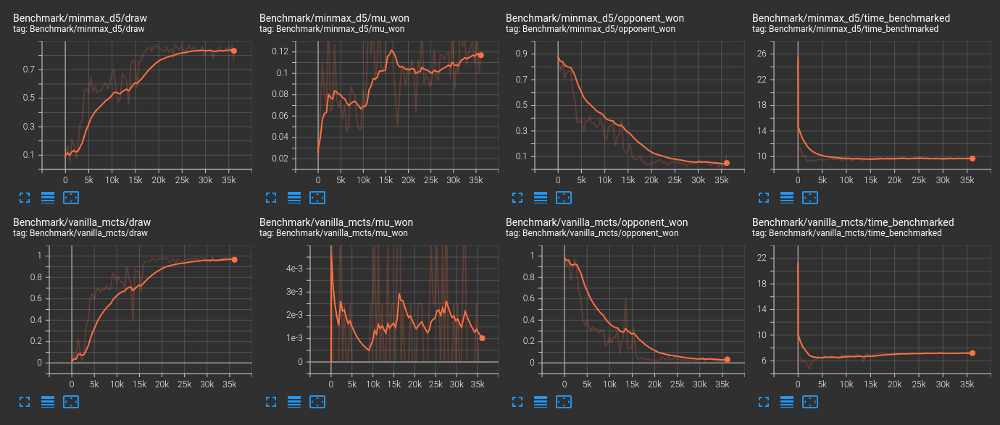

# MuZero
This package started as Google Summer of Code 2021 [project](https://summerofcode.withgoogle.com/projects/#4538531164192768).

Here's a [blogpost](https://michelangelo21.github.io/gsoc/2021/08/23/gsoc-2021.html) summarizing MuZero's summer journey.

This implementation is based on [AlphaZero.jl](https://github.com/jonathan-laurent/AlphaZero.jl),
and is inspired by [muzero-general](https://github.com/werner-duvaud/muzero-general).
## TicTacToe Example
To train MuZero on tic tac toe, clone this repo, change branch to MuZero,
```sh
git clone https://github.com/michelangelo21/MuZero.git
cd MuZero
git checkout MuZero
```
and run
```sh
julia --project -e 'import Pkg; Pkg.instantiate()'
julia --project ./MuZero/scripts/train_tictactoe.jl 
```
then, to observe results, open `tensorboard` in a different terminal:
```sh
tensorboard --logdir results
```

after some time curves should look like this:



## Acknowledgement
This implementation wouldn't exist without [Jonathan Laurent](https://github.com/jonathan-laurent) (project mentor, creator of [AlphaZero.jl](https://github.com/jonathan-laurent/AlphaZero.jl)) and his valuable insights.